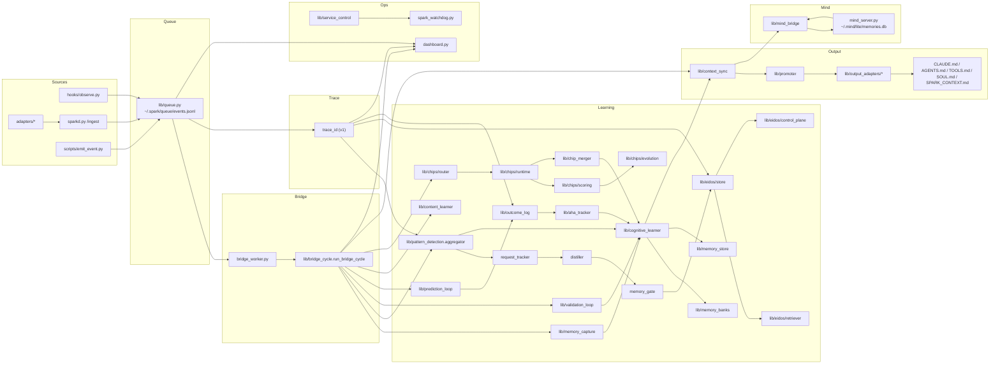

# Intelligence_Flow_Map.md

Generated: 2026-02-03

This file provides a high-level visual map of Spark Intelligence data flow.
For exhaustive tuneables and file interactions, see Intelligence_Flow.md.

