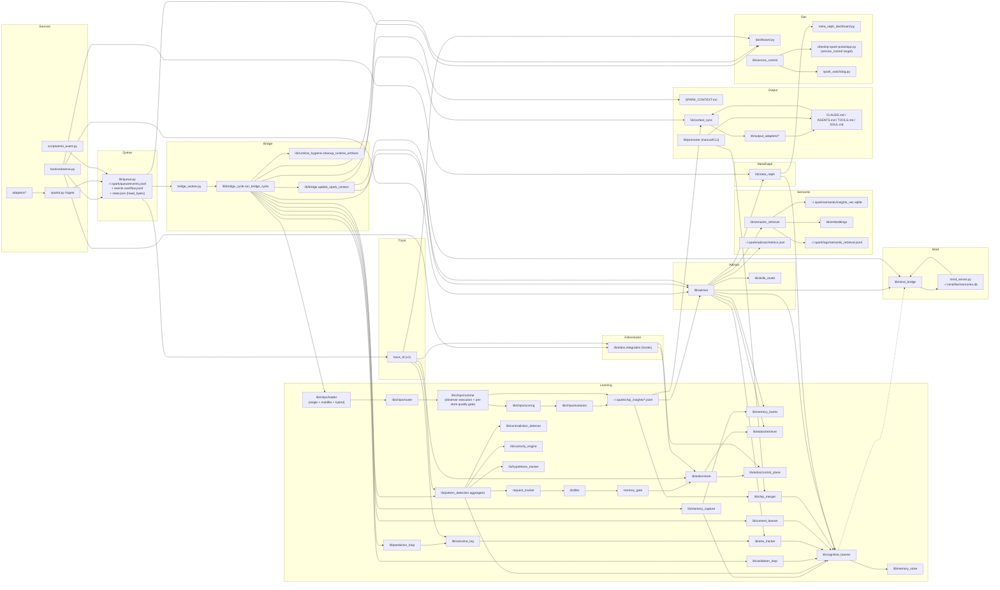

# Intelligence_Flow_Map.md

Generated: 2026-02-06
Navigation hub: `docs/GLOSSARY.md`

This file provides a high-level visual map of Spark Intelligence data flow.
For exhaustive tuneables and file interactions, see Intelligence_Flow.md.

Brief overview:
Spark Intelligence captures events (hooks/adapters/sparkd) into a queue, runs a bridge cycle to extract signals, and turns them into learnings (cognitive insights, memory bank entries, EIDOS distillations). Queue consumption uses a logical head pointer with overflow spillover to reduce rewrite contention. Bridge-cycle persistence is batched so cognitive/meta stores flush once per cycle instead of per event, and runtime hygiene now prunes stale heartbeat/PID/tmp artifacts each cycle. Meta-Ralph quality-gates what is stored, outcomes feed back into reliability, and Advisor/Context Sync surface those learnings before actions. Chips now load across single, multifile, and hybrid YAML formats, normalize event aliases, and apply pre-storage scoring gates so low-value telemetry is filtered before it reaches chip memory. High-value chip insights are merged into cognitive memory and also surfaced directly to Advisor and Context Sync, with stable dedupe and low-quality cooldown suppression in chip merge. Exposure streams from sync-heavy sources are deduped/capped to reduce prediction-loop noise. Context sync defaults to core adapters (`openclaw`, `exports`) so optional adapter failures do not pollute baseline health, and advisory packet fallback emission is opt-in to reduce low-signal output. If that fallback path is enabled, a fallback-rate guard limits fallback-heavy advisory loops. Advisory memory fusion now filters primitive tool-error telemetry before ranking evidence. Chip merge also has duplicate-churn throttling to skip repeated no-yield cycles. When semantic retrieval is enabled, Advisor runs an embeddings-first fast path and only escalates to agentic fanout under a minimal gate (weak count, weak score, high-risk), with deadline/rate-cap controls and route telemetry in `~/.spark/advisor/retrieval_router.jsonl`. Mind usage is now policy-aligned across packet/live advisory paths, stale Mind reads can be gated with fallback-on-empty behavior, and SPARK_CONTEXT source labels preserve true provenance (bank/taste/mind) instead of collapsing to `mind:*`. This map shows the systems and data stores; Intelligence_Flow.md covers exact configs, tuneables, and file-level interactions.

