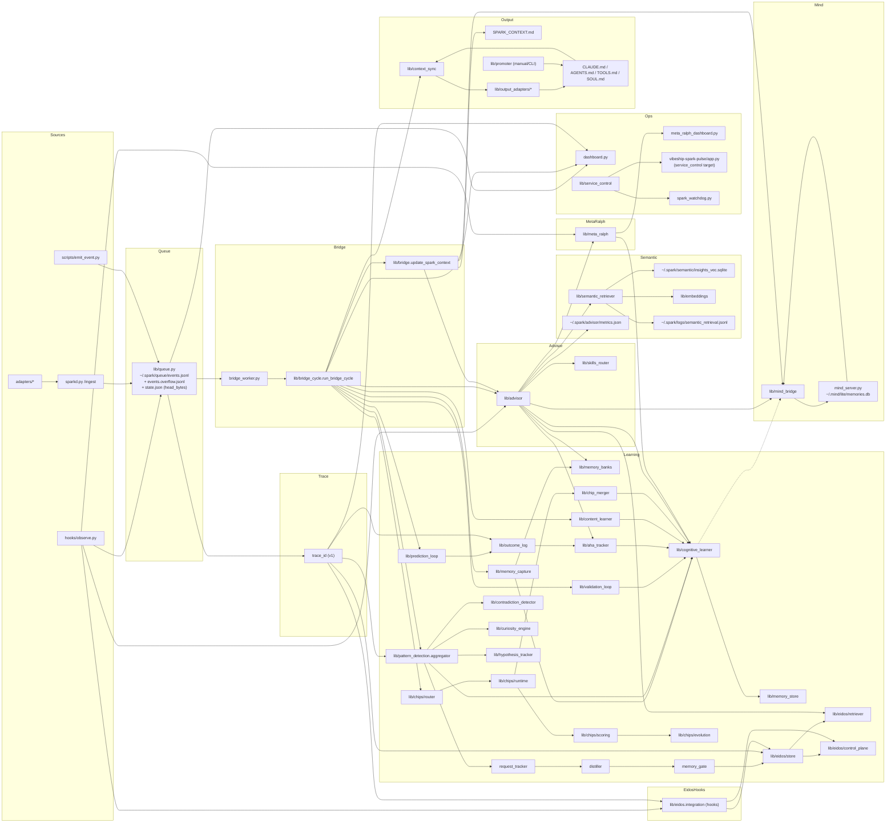

# Intelligence_Flow_Map.md

Generated: 2026-02-05

This file provides a high-level visual map of Spark Intelligence data flow.
For exhaustive tuneables and file interactions, see Intelligence_Flow.md.

Brief overview:
Spark Intelligence captures events (hooks/adapters/sparkd) into a queue, runs a bridge cycle to extract signals, and turns them into learnings (cognitive insights, memory bank entries, EIDOS distillations). Queue consumption uses a logical head pointer with overflow spillover to reduce rewrite contention. Bridge-cycle persistence is batched so cognitive/meta stores flush once per cycle instead of per event. Meta-Ralph quality-gates what is stored, outcomes feed back into reliability, and Advisor/Context Sync surface those learnings before actions. When semantic retrieval is enabled, Advisor extracts intent from the current task, matches triggers, runs embedding search over stored insights, fuses scores (similarity + recency + outcome), and returns the top guidance with "why" so learnings are actually used during real work. This map shows the systems and data stores; Intelligence_Flow.md covers exact configs, tuneables, and file-level interactions.

