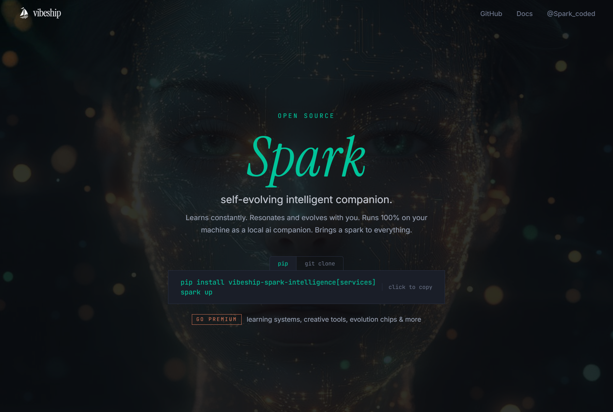

<p align="center">
  <a href="https://spark.vibeship.co"></a>
</p>
<p align="center">
  <a href="https://github.com/vibeforge1111/vibeship-spark-intelligence/blob/main/LICENSE"></a>
  
  
  
</p>

---

Learns constantly. Adapts with your flow.
Runs 100% on your machine as a local AI companion that turns past work into future-ready behavior.
It is designed to be beyond a learning loop.

`You do work` -> `Spark captures memory` -> `Spark distills and transforms it` -> `Spark delivers advisory context` -> `You act with better context` -> `Outcomes re-enter the loop`

## What is Spark?

Spark Intelligence is a self-evolving AI companion designed to grow smarter through use.

It is:
- Not a chatbot.
- Not a fixed rule set.
- A living intelligence runtime that continuously converts experience into adaptive operational behavior, not just stored memory.

The goal is to keep context, patterns, and practical lessons in a form that your agent can actually use at the right moment.

## Beyond a Learning Loop: Intelligence Operating Flow

- Capture: hooks and events from your agent sessions are converted into structured memories.
- Distill: noisy data is filtered into reliable, action-oriented insights.
- Transform: high-value items are shaped for practical reuse (prioritized by reliability, context match, and usefulness).
- Store: distilled wisdom is persisted and versioned in local memory stores.
- Act: advisory and context updates are prepared for the right point in workflow.
- Guard: gating layers check quality, authority, cooldown, and dedupe before any advisory is surfaced.
- Learn: outcomes and follow-through are fed back to refine future recommendations.

## Install

Prerequisites:
- Python 3.10+
- `pip`
- Git
- Windows one-liner path: PowerShell
- Mac/Linux one-liner path: `curl` + `bash`

Windows one-command bootstrap (clone + venv + install + start):

```powershell
irm https://raw.githubusercontent.com/vibeforge1111/vibeship-spark-intelligence/main/install.ps1 | iex
```

Then verify runtime readiness (second command, from repo root):

```powershell
.\.venv\Scripts\python -m spark.cli up
.\.venv\Scripts\python -m spark.cli health
```

If you already cloned the repo, run the local bootstrap:

```powershell
.\install.ps1
```

If you are running from `cmd.exe` or another shell:

```powershell
powershell -NoProfile -ExecutionPolicy Bypass -Command "irm https://raw.githubusercontent.com/vibeforge1111/vibeship-spark-intelligence/main/install.ps1 | iex"
```

Mac/Linux one-command bootstrap (clone + venv + install + start):

```bash
curl -fsSL https://raw.githubusercontent.com/vibeforge1111/vibeship-spark-intelligence/main/install.sh | bash
```

Then verify runtime readiness (second command, from repo root):

```bash
./.venv/bin/python -m spark.cli up
./.venv/bin/python -m spark.cli health
```

Mac/Linux manual install:

```bash
git clone https://github.com/vibeforge1111/vibeship-spark-intelligence
cd vibeship-spark-intelligence
python3 -m venv .venv && source .venv/bin/activate
python -m pip install -e .[services]
```

If your system uses PEP 668 / external package management, this avoids the
`externally-managed-environment` error:

```bash
python3 -m venv .venv
source .venv/bin/activate
python -m pip install -e .[services]
```

Or run directly with editable install:

```bash
python -m pip install vibeship-spark-intelligence[services]
python -m spark.cli up
```

## Quick Start

```bash
# Check health
python -m spark.cli health

# View what Spark has learned
python -m spark.cli learnings
```

Windows: run `start_spark.bat` from the repo root.

Lightweight mode (core only, no Pulse/watchdog): `spark up --lite`

## Connect Your Agent

Spark works with any coding agent that supports hooks or event capture.

| Agent | Integration | Guide |
|-------|------------|-------|
| **Claude Code** | Hooks (PreToolUse, PostToolUse, UserPromptSubmit) | `docs/claude_code.md` |
| **Cursor / VS Code** | tasks.json + emit_event | `docs/cursor.md` |
| **OpenClaw** | Session JSONL tailer | `docs/openclaw/` |

## What You Get

- **Self-evolving companion behavior** — adapts from your sessions instead of staying static.
- **Signal capture** — hooks + event ingestion for tool actions, prompts, and outcomes.
- **Distillation pipeline** — low-quality/raw observations are filtered out before storage.
- **Transformation layer** — converts insight candidates into actionable advisory-ready forms.
- **Advisory delivery** — pre-tool guidance ranked across retrieval sources with cool-down and dedupe.
- **EIDOS loop** — prediction → outcome → evaluation for continuous quality updates.
- **Domain chips** — pluggable expertise modules that can specialize behavior.
- **Observability surfaces** — Obsidian Observatory in-repo, plus optional external Spark Pulse and local Meta-Ralph views.
- **CLI** — `spark status`, `spark learnings`, `spark promote`, `spark up/down`, and more.
- **Hot-reloadable config** — tuneables with schema checks and live behavior shifts.

## Architecture

```
Your Agent (Claude Code / Cursor / OpenClaw)
  -> hooks capture events
  -> queue -> bridge worker -> pipeline
  -> quality gate (Meta-Ralph) -> cognitive learner
  -> distillation -> transformation -> advisory packaging
  -> pre-tool advisory surfaced + context files refreshed
```

## Obsidian Observatory

Spark ships with an [Obsidian](https://obsidian.md) integration that turns the entire intelligence pipeline into a human-readable vault you can browse, search, and query — every insight, every decision, every quality verdict, visible in one place.

### Install Obsidian

1. Download [Obsidian](https://obsidian.md) (free, available on Windows / Mac / Linux)
2. Install and open it

### Generate the Observatory

```bash
# From the spark-intelligence repo:
python scripts/generate_observatory.py --force --verbose
```

This reads your `~/.spark/` state files and generates ~465+ markdown pages in under 1 second.

**Default vault location:** `~/Documents/Obsidian Vault/Spark-Intelligence-Observatory`

To change it, edit `observatory.vault_dir` in `~/.spark/tuneables.json` or `config/tuneables.json`.

### Open the Vault

1. In Obsidian: **File > Open vault > Open folder as vault**
2. Select `Spark-Intelligence-Observatory`
3. It opens to `_observatory/flow.md` — the main pipeline dashboard

The vault comes pre-configured with:
- **Dataview plugin** pre-installed (for live queries on all data)
- **Workspace** set to open the Flow Dashboard + Dataview Dashboard
- **Graph view** color-coded: green = pipeline stages, blue = explorer items, orange = advisory packets

### Install Dataview (recommended)

If Dataview didn't auto-install from the pre-configured vault:

1. Go to **Settings > Community plugins > Turn on community plugins**
2. Click **Browse** > search "Dataview" > **Install** > **Enable**
3. The `Dashboard.md` queries will now render live tables

### What You Can See

#### Flow Dashboard (`_observatory/flow.md`)

A live Mermaid diagram of the full 12-stage pipeline with embedded metrics — queue depth, processing rate, insight counts, advisory follow rate, and more. Plus a system health table with status badges.

#### 12 Stage Detail Pages (`_observatory/stages/`)

Each pipeline stage gets its own page with health metrics, recent activity, and upstream/downstream links:

| Stage | What it shows |
|-------|--------------|
| Event Capture | Hook heartbeat, session tracking |
| Queue | Pending events, file size, overflow |
| Pipeline | Processing rate, batch size, empty cycles |
| Memory Capture | Importance scores, category distribution |
| Meta-Ralph | Quality verdicts, pass rate, score distribution |
| Cognitive Learner | Insight count, reliability leaders, categories |
| EIDOS | Episodes, steps, distillations, predict-evaluate loop |
| Advisory | Follow rate, source effectiveness, recent advice |
| Promotion | Targets, recent activity, result distribution |
| Chips | Domain modules, per-chip activity and size |
| Predictions | Outcomes, surprise tracking, link rate |
| Tuneables | Current config, all sections listed |

#### Explorer — Browse Your Data (`_observatory/explore/`)

Click into any data store and browse individual items:

| Dataset | Pages | What you see |
|---------|-------|-------------|
| **Cognitive Insights** | ~150 detail pages | Reliability, validations, evidence, counter-examples |
| **EIDOS Distillations** | ~90 detail pages | Statement, confidence, domains, triggers |
| **EIDOS Episodes** | ~100 detail pages | Goal, outcome, every step with prediction vs evaluation |
| **Meta-Ralph Verdicts** | ~100 detail pages | Score breakdown (6 dimensions), input text, issues |
| **Advisory Decisions** | Index table | Every emit/suppress/block decision with reasons |
| **Implicit Feedback** | Index table | Followed/ignored signals, per-tool follow rates |
| **Retrieval Routing** | Index table | Route distribution, why advice was/wasn't surfaced |
| **Tuneable Evolution** | Index table | Parameter changes over time with impact analysis |
| **Promotions** | Index table | What got promoted to CLAUDE.md and why |
| **Advisory Effectiveness** | Index table | Source effectiveness, overall follow rate |

#### Canvas View (`_observatory/flow.canvas`)

A spatial layout of the pipeline — drag, zoom, click through to any stage. Great for presentations or getting the big picture.

#### Dataview Dashboard (`Dashboard.md`)

Pre-built live queries you can customize:
- High-reliability insights (90%+)
- Promoted insights and where they went
- Recent successful and failed episodes
- Meta-Ralph verdicts with high scores
- Most-retrieved distillations
- Advisory health and feedback signals
- System evolution tracking

### Auto-Sync

When Spark's pipeline is running, the observatory auto-refreshes every 120 seconds. No manual regeneration needed. To regenerate manually:

```bash
python scripts/generate_observatory.py --force --verbose
```

### Configuration

All settings live in the `observatory` section of your tuneables:

```json
{
  "observatory": {
    "enabled": true,
    "auto_sync": true,
    "sync_cooldown_s": 120,
    "vault_dir": "path/to/your/vault",
    "generate_canvas": true,
    "max_recent_items": 20,
    "explore_cognitive_max": 200,
    "explore_distillations_max": 200,
    "explore_episodes_max": 100,
    "explore_verdicts_max": 100,
    "explore_decisions_max": 200,
    "explore_feedback_max": 200,
    "explore_routing_max": 100,
    "explore_tuning_max": 200
  }
}
```

Edit `~/.spark/tuneables.json` (runtime) or `config/tuneables.json` (version-controlled).

### Tips

- **Start from `flow.md`** — it's the entry point. Drill down into stages, then into the explorer.
- **Don't edit `_observatory/` files** — they get regenerated. Use `Dashboard.md` or create your own notes alongside.
- **Use Graph View** — filter to `_observatory` to see how everything connects.
- **Bookmark items** — bookmarks persist across regenerations since file paths stay stable.
- **Keep limits under 500** per explorer section for smooth Obsidian performance.
- **Pin `flow.md` as a tab** — always-visible health check.
- **Use the Canvas for demos** — `flow.canvas` is a great way to explain the system to others.

Full guide: [`docs/OBSIDIAN_OBSERVATORY_GUIDE.md`](docs/OBSIDIAN_OBSERVATORY_GUIDE.md)

## Documentation

- **5-minute start**: `docs/GETTING_STARTED_5_MIN.md`
- **Full setup**: `docs/QUICKSTART.md`
- **Obsidian Observatory**: `docs/OBSIDIAN_OBSERVATORY_GUIDE.md`
- **Docs index**: `docs/DOCS_INDEX.md`
- **Website**: [spark.vibeship.co](https://spark.vibeship.co)
- **Contributing**: `CONTRIBUTING.md` (local setup, PR flow, and safety expectations)

## Responsible Use

This is a self-evolving system. If you are planning a public release or high-autonomy deployment:
- Read first: `docs/AI_MANIFESTO.md`
- Read first: https://aimanifesto.vibeship.co/
- `docs/RESPONSIBLE_PUBLIC_RELEASE.md`
- `docs/security/THREAT_MODEL.md`
- `SECURITY.md` for vulnerability reporting

## License

[MIT](LICENSE) — free to use, modify, and distribute.

---

<p align="center">
  <sub>Built by <a href="https://vibeship.com">Vibeship</a></sub>
</p>
